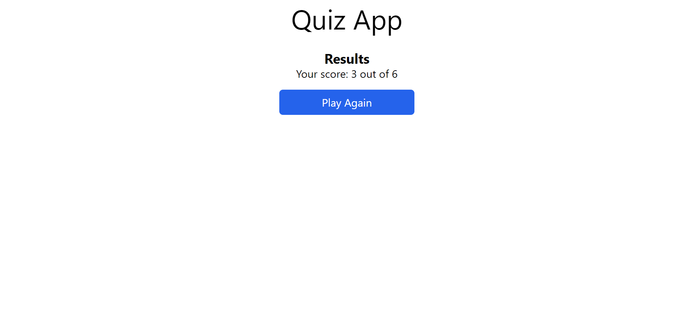

# TASK 1

Quiz App: Create a simple quiz app

- Must be able to view the questions
- Must be able to fill the answer
- At a time only one question to be visible and upon clicking next button next question appears.
- Final results must be shown (Only number of correct answers and wrong answers.)
- Utilizing localstorage or any database would be appreciated but not compulsory.

Note: Css Styles is optional Furthermore, the incorporation of any additional technologies or frameworks, compatible with the JavaScript language, is explicitly permitted and encouraged to enhance the functionality and aesthetics of these projects.

## Project Screenshots




## Project Setup

Fork the repository and clone it (or download the zip file and extract it)

```bash
git clone git@github.com:dshreejal/Internship-Amnil.git
```

Change directory to the project directory

```bash
cd Internship-Amnil/task-1
```

- Change directory to the server to start the server

  ```bash
  cd server
  ```

  Install the required dependencies

  ```bash
  npm install
  ```

  Run the development server

  ```bash
  npm run dev
  ```

- Change directory to the client to start the react application

  ```bash
  cd client
  ```

  Install the required dependencies

  ```bash
  npm install
  ```

  Run the development server

  ```bash
  npm run dev
  ```
